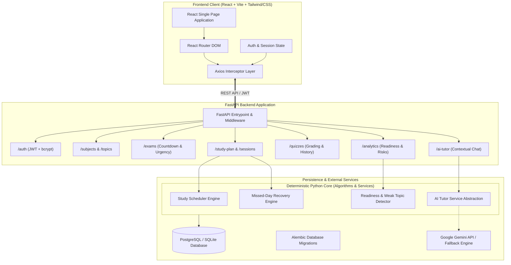
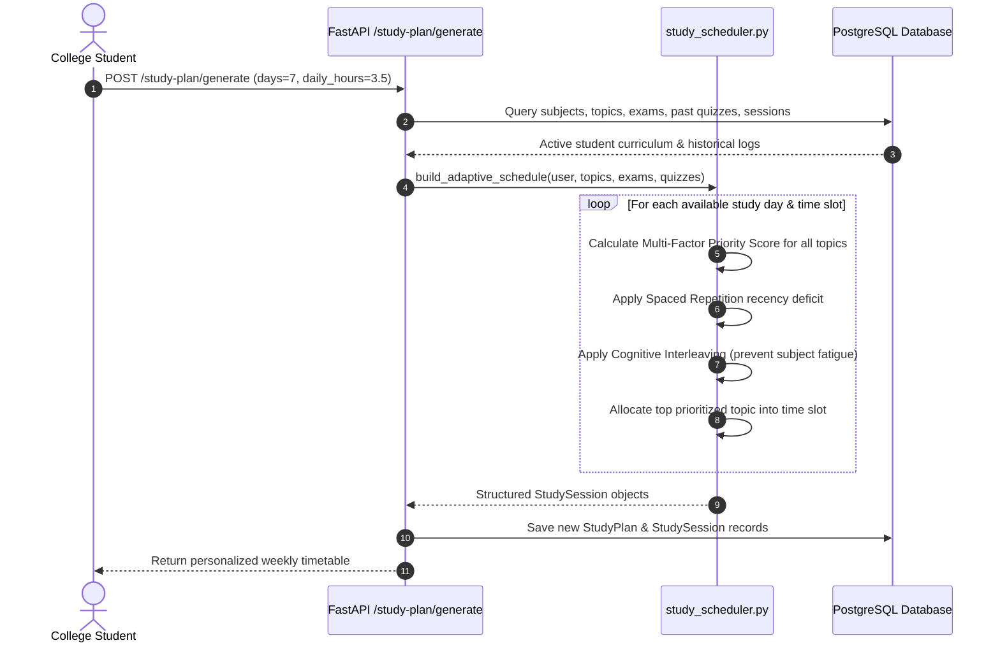
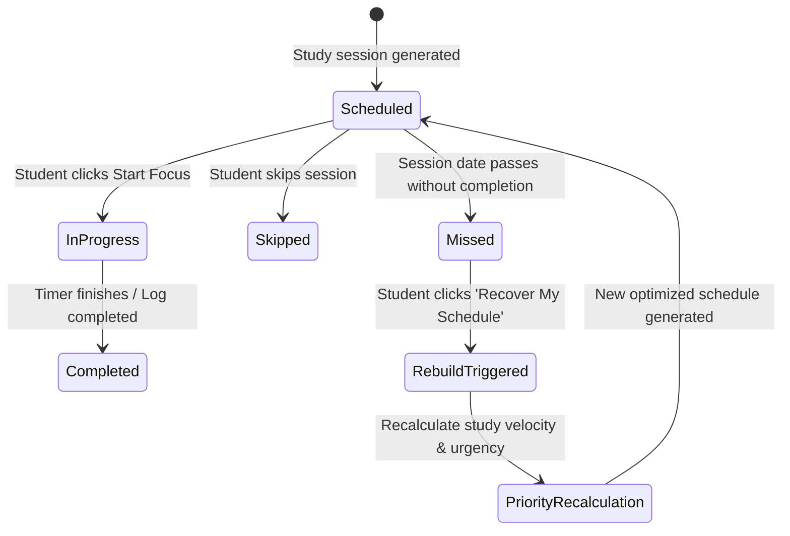

# StudyPilot — System Architecture

StudyPilot is an adaptive, data-driven study planning platform designed to optimize college exam preparation and self-paced technical learning.

Unlike generic timetable generators or shallow LLM wrappers, StudyPilot pairs a **deterministic multi-factor Python scheduling and optimization engine** with **persistent relational tracking**, **real-time readiness metrics**, **spaced-repetition topic scoring**, **adaptive missed-day recovery**, and a **context-aware AI Tutor**.

---

## 1. High-Level System Architecture

---

## 2. Core Scheduling & Prioritization Pipeline

---

## 3. Mathematical Models & Scoring Formulas

### 3.1. Topic Priority Scoring Engine
Every candidate topic $T$ is assigned a dynamic priority score:

$$\text{PriorityScore}(T) = W_{\text{urgency}}(S) + W_{\text{weakness}}(T) + W_{\text{difficulty}}(T) + W_{\text{incomplete}}(T) + W_{\text{quiz}}(T) + W_{\text{recency}}(T) + W_{\text{missed}}(T)$$

Where:
* **Exam Urgency ($W_{\text{urgency}}$)**: If subject $S$ has an exam in $D$ days:
  $$W_{\text{urgency}} = \text{PriorityMultiplier} \times \min\left(100, \frac{150}{D + 1}\right)$$
  (Urgent: $\times 1.6$, High: $\times 1.3$, Medium: $\times 1.0$, Low: $\times 0.7$)
* **Weakness / Proficiency Deficit ($W_{\text{weakness}}$)**: Multiplier on topic proficiency $P \in [1, 5]$:
  $$W_{\text{weakness}} = (6 - P) \times 12.0$$
* **Difficulty Factor ($W_{\text{difficulty}}$)**: Difficulty level $K \in [1, 5]$:
  $$W_{\text{difficulty}} = K \times 8.0$$
* **Incomplete Work ($W_{\text{incomplete}}$)**: Remaining estimated hours $H_{\text{rem}}$:
  $$W_{\text{incomplete}} = \min(30, \frac{H_{\text{rem}}}{H_{\text{est}}} \times 20 + H_{\text{rem}} \times 2)$$
* **Quiz Deficit ($W_{\text{quiz}}$)**: If latest quiz score $Q_{\text{pct}}$ exists:
  $$W_{\text{quiz}} = (100 - Q_{\text{pct}}) \times 0.30$$
* **Spaced Repetition Recency ($W_{\text{recency}}$)**: Days since last session $D_{\text{last}}$:
  $$W_{\text{recency}} = \min(25, D_{\text{last}} \times 2.5)$$
* **Missed Sessions Penalty ($W_{\text{missed}}$)**: Count of previously missed sessions:
  $$W_{\text{missed}} = \min(30, \text{MissedCount} \times 8.0)$$

### 3.2. Subject & Exam Readiness Formulation
$$\text{SubjectReadiness} = (0.40 \times \text{TopicCompletionPct}) + (0.35 \times \text{NormalizedProficiency}) + (0.25 \times \text{AvgQuizScore})$$

$$\text{ExamReadiness} = \text{SubjectReadiness} \times \left(0.60 + 0.40 \times \min\left(1.0, \frac{\text{AvailableStudyHoursRemaining}}{\text{RemainingEstimatedHoursRequired}}\right)\right)$$

### 3.3. Weak Topic Risk Classification
$$\text{RiskScore} = (0.35 \times \text{ProficiencyDeficit}) + (0.35 \times \text{QuizDeficit}) + (0.20 \times \text{MissedRate} \times 100) + (0.10 \times \text{DifficultyFactor})$$
* **HIGH RISK**: Score $\ge 60\%$
* **MEDIUM RISK**: $35\% \le \text{Score} < 60\%$
* **LOW RISK**: Score $< 35\%$

---

## 4. Adaptive Recovery Flow

---

## 5. Security & Authentication Architecture
* **Password Hashing**: Bcrypt with salt generation.
* **Token Standard**: Signed JWT using `HS256` containing `sub` (User ID), `iat`, `exp` (7-day validity).
* **Route Protection**: FastAPI dependency injection via `get_current_user` and OAuth2 Bearer token validation.
* **CORS & Environment Isolation**: Configured for local development (`http://localhost:5173`) and production frontend domains.
